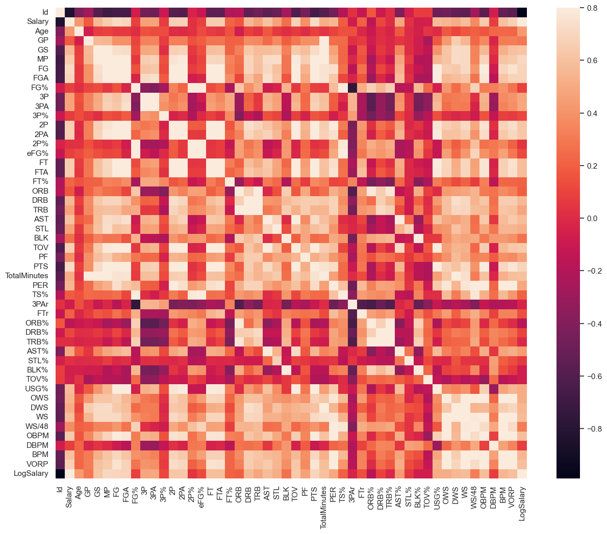
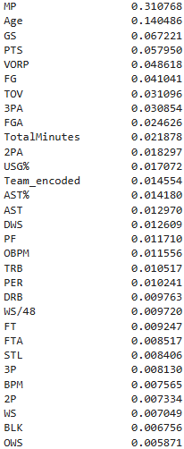
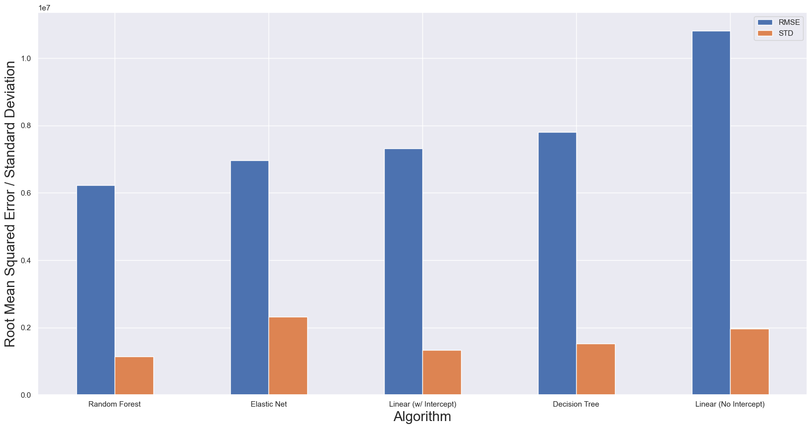

# NBA Salary Analysis & Prediction Model

## Overview
This project analyzes NBA player performance data to identify key factors influencing salary and builds predictive models to estimate player salaries.

## Tools Used
- Python
- pandas
- scikit-learn
- statsmodels
- matplotlib / seaborn

## Dataset
The dataset includes NBA player statistics such as minutes played, points, assists, and salary.

## Process

### Data Cleaning
- Renamed columns and removed unnecessary variables
- Handled missing values (filled stats with 0 where appropriate)
- Removed players with fewer than 20 games played

### Exploratory Data Analysis
- Identified strong relationships between performance metrics and salary
- Observed right-skewed salary distribution
- Applied log transformation to normalize target variable

### Modeling
Built and compared:
- Multiple Linear Regression
- Ridge & Lasso Regression
- Decision Tree
- Random Forest

### Evaluation
- Used R² and RMSE to evaluate performance
- Random Forest achieved the strongest test performance

## Key Findings
- Minutes played, points, turnovers, and age were strong predictors of salary
- Log transformation improved model performance significantly
- Tree-based models captured non-linear relationships better than linear models

## Visualizations

## Takeaways
- Salary prediction benefits from both statistical and machine learning approaches
- Data preprocessing plays a critical role in model performance

## Future Improvements
- Include contract details and team-level data
- Expand dataset across multiple seasons
